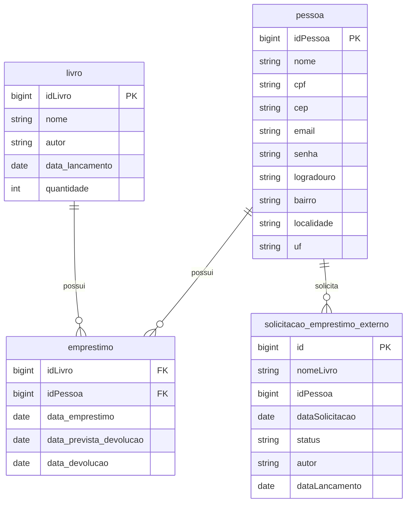

# BIBLIOTECA API REST

API REST desenvolvida com Spring Boot para gerenciar livros, pessoas (leitores) e empréstimos. Projeto da rota Back-end do processo seletivo da Emakers Jr. Inclui autenticação JWT, documentação OpenAPI, integração externa de CEP (ViaCEP), integração de busca de livros (Google Books) e containerização com Docker.

---

## Índice

* [Descrição do Projeto](#descrição)
* [Tecnologias Utilizadas](#tecnologias-utilizadas-)
* [Modelagem de Dados](#modelagem-de-dados)
* [Arquitetura e Organização de Código](#arquitetura-e-organização-do-código)
* [Instalação e Configuração](#instalação-e-configuração)
* [Uso](#uso)
* [Testes](#testes)
* [Licença](#licença)
* [Autor](#autor)
* [Contato](#contato)

---

## Descrição

Esta API permite:
- Cadastro, consulta, atualização e remoção de livros.
- Cadastro e gerenciamento de pessoas com enriquecimento de endereço via CEP (integração com ViaCEP).
- Criação e controle de empréstimos (limite de 3 ativos por pessoa, devolução, histórico, atrasados).
- Solicitação de empréstimo externo (registro de interesse em livro não existente no acervo).
- Autenticação e autorização via JWT com perfis (roles) USER / ADMIN.
- Documentação interativa (Swagger UI) e respostas de erro padronizadas.

Não há roadmap de evolução pós-seletivo; foco em clareza, boas práticas e entregáveis essenciais.

---

## Tecnologias Utilizadas 🚀

| Categoria | Tecnologia | Observação |
|-----------|------------|------------|
| Linguagem | Java 21 | |
| Framework | Spring Boot 3.5.x | Core da aplicação |
| Persistência | Spring Data JPA (Hibernate) | ORM para PostgreSQL |
| Banco de Dados | PostgreSQL 16 | Via Docker Compose |
| Migrations | Flyway | Schema inicial versionado (V1) |
| Validação | Jakarta Validation | @Valid em DTOs |
| Segurança | Spring Security + JWT (java-jwt) | Stateless, filtro custom |
| Documentação | springdoc-openapi | Swagger UI / OpenAPI 3 |
| Observabilidade | Spring Actuator | Healthcheck Docker |
| Build | Maven Wrapper | mvnw / mvnw.cmd |
| Container | Docker / Docker Compose | Empacotamento e orquestração |
| Integração Externa | ViaCEP / Google Books API | CEP (endereço) / Busca externa de livros |
| Utilitário | Lombok | Reduz boilerplate em entidades/DTOs |

> Observação: Flyway está em uso (baseline V1). Alterações futuras de schema devem ser adicionadas como novos arquivos `V2__...` em `db/migration`.

---

## Modelagem de Dados

### Entidades Principais

* **Pessoa (pessoa)**: idPessoa, nome, cpf, cep, email, senha (BCrypt), role (USER|ADMIN), logradouro, bairro, localidade, uf
* **Livro (livro)**: idLivro, nome, autor, data_lancamento, quantidade
* **Empréstimo (emprestimo)**: (idLivro FK, idPessoa FK) + data_emprestimo, data_prevista_devolucao (prazo padrão 7 dias), data_devolucao
* **SolicitacaoEmprestimoExterno**: id, nomeLivro, idPessoa, dataSolicitacao, status (PENDENTE|APROVADA|REJEITADA)
	*Campos `autor` e `dataLancamento` existem na entidade mas não são recebidos no request DTO nem retornados no response atualmente (ficam nulos). Ao aprovar solicitação o livro criado recebe autor "Desconhecido" se não houver ajuste.*


Limites/Regras (implementadas):
- Quantidade do livro decrementa ao emprestar e incrementa na devolução.
- Limite de 3 empréstimos ativos por pessoa.
- Prazo padrão de devolução: 7 dias a partir do empréstimo.
- Aprovação de solicitação externa cadastra exemplar (quantidade inicial = 1) e já gera empréstimo (quantidade vai para 0). Rejeição apenas muda status.
- Listagens ordenadas: livros e pessoas por ID asc; empréstimos gerais por idLivro/idPessoa, históricos por data de empréstimo, atrasados por data prevista.

Observações sobre DTOs:
- `LivroResponseDTO` retorna somente idLivro, nome, autor (quantidade e data de lançamento ficam internas para simplicidade de apresentação).
- `SolicitacaoEmprestimoExternoResponseDTO` não expõe autor/dataLancamento apesar de citados na entidade.


### Diagrama (Mermaid)



---

## Arquitetura e Organização do Código

Estrutura em camadas:

* **controller/**: Endpoints REST (LivroController, PessoaController, EmprestimoController, AuthenticationController, SolicitacaoEmprestimoExternoController).
* **service/**: Regras de negócio e integrações (validações de limite, decremento de estoque, ViaCEP, etc.).
* **repository/**: Interfaces JPA para acesso a dados.
* **data/dto/**: DTOs de request e response para isolamento de modelo.
* **data/entity/**: Entidades JPA.
* **exception/general/**: Exceções custom (ResourceNotFoundException, BusinessRuleException) e handler global (RestExceptionHandler) com objeto de erro uniforme.
* **infra/security/**: Configurações de segurança, filtro JWT, geração/validação de token.
* **infra/config/**: Configurações transversais (CORS opcional, Swagger/OpenAPI).
* **client/**: Cliente ViaCEP.
* **resources/**: `application.properties`, migrations Flyway (`db/migration`), configuração adicional e assets.

Padrões adotados:
- Respostas de erro consistentes (timestamp, status, message, path, validation errors).
- Status HTTP corretos (201 criação, 204 delete, 404 not found, 422 regra negócio, 400 validação, 401/403 segurança, 409 integridade, 500 genérico).
- JWT stateless sem sessão de servidor.

---

## Instalação e Configuração

### Pré-requisitos
* Java 21
* Maven (wrapper já incluso)
* Docker e Docker Compose (opcional, recomendado)
* PostgreSQL (se executar sem Docker)

### Execução com Docker (recomendado)

```bash
docker compose up -d --build
```

Serviços:
- API: http://localhost:8080
- Swagger UI: http://localhost:8080/swagger-ui/index.html
- Health: http://localhost:8080/actuator/health

Logs:
```bash
docker logs -f biblioteca_api
```
Parar:
```bash
docker compose down
```
Limpar volumes (apaga dados):
```bash
docker compose down -v
```

### Variáveis de Ambiente Principais
| Variável | Descrição | Default |
|----------|-----------|---------|
| DB_URL | JDBC Postgres | jdbc:postgresql://db:5432/biblioteca |
| DB_USER | Usuário BD | postgres |
| DB_PASSWORD | Senha BD | postgres |
| JWT_SECRET | Segredo JWT | my-secret-key |

Override: criar `.env` ou definir antes do comando docker compose.

### Execução Local (sem Docker)
```bash
./mvnw spring-boot:run  # Linux/Mac
mvnw.cmd spring-boot:run # Windows
```
Banco: ajustar application.properties se porta ou credenciais diferirem.

Nota rápida sobre migrations: schema inicial está em `db/migration/V1__create_schema.sql`; futuras mudanças de estrutura devem ser adicionadas como `V2__...`, mantendo o V1 intacto.

---

## Uso

Autenticação JWT:
1. Registrar pessoa (USER ou ADMIN) em POST /auth/register (valida CEP e preenche endereço).
2. Autenticar em /auth/login e obter token.
3. Enviar Authorization: Bearer <token> nas rotas protegidas.

### Regras de Acesso (Autorização)
| Recurso | Método(s) | Acesso |
|---------|-----------|--------|
| /auth/register, /auth/login | POST | Público |
| /actuator/health | GET | Público |
| /v3/api-docs/**, /swagger-ui/** | GET | Público |
| /livros/** (GET) | GET | Público |
| /livros/** (POST/PUT/DELETE) | Mutação | ADMIN |
| /pessoas (POST) | POST | ADMIN (CRUD administrativo) |
| /pessoas/** | GET/PUT/DELETE | ADMIN |
| /emprestimos/** | Todos | USER ou ADMIN (filtros adicionais no controller) |
| /emprestimos/externo/** | Todos | USER ou ADMIN |

Observação: Além das regras globais, o `EmprestimoController` restringe acesso de USER a seus próprios registros/histórico.

Endpoints (principais) (implementados):
- /auth/register (POST cria pessoa – valida CEP e enriquece endereço; role padrão USER)
- /auth/login (POST autentica e retorna token JWT)
- /livros (GET público / POST ADMIN)
- /livros/{id} (GET público / PUT, DELETE ADMIN)
- /livros/buscar-externo?termo= (GET público – Google Books)
- /pessoas (ADMIN: GET lista, POST cria)
- /pessoas/{id} (ADMIN: GET, PUT, DELETE)
- /emprestimos (GET lista todos; POST cria – USER/ADMIN; controller aplica validações de propriedade)
- /emprestimos/{idLivro}/{idPessoa} (GET detalha – USER só se próprio; OBS: devolução e exclusão usam rota reduzida abaixo)
- /emprestimos/{idLivro} (PUT devolução; DELETE remove) – idPessoa sempre inferido do usuário autenticado (mesmo ADMIN). Para permitir operar em nome de terceiros seria preciso ajustar assinatura do controller.
- /emprestimos/ativos (GET)
- /emprestimos/atrasados (GET)
- /emprestimos/historico/pessoa/{idPessoa}
- /emprestimos/historico/livro/{idLivro}
- /emprestimos/externo (POST criar solicitação)
- /emprestimos/externo/solicitacoes (GET listar)
- /emprestimos/externo/solicitacoes/{id}/aprovar (PUT)
- /emprestimos/externo/solicitacoes/{id}/rejeitar (PUT)
- /emprestimos/externo/solicitacoes/{id} (DELETE)

### Exemplos (curl)

Registrar pessoa (público):
```bash
curl -X POST http://localhost:8080/auth/register \
	-H "Content-Type: application/json" \
	-d '{
		"nome":"João Silva",
		"email":"joao@exemplo.com",
		"cep":"01001-000",
		"cpf":"123.456.789-01",
		"password":"minhaSenhaSegura"
	}'
```

Login (gerar token JWT):
```bash
curl -X POST http://localhost:8080/auth/login \
	-H "Content-Type: application/json" \
	-d '{"login":"admin@exemplo.com","password":"senha123"}'
```
Resposta esperada:
```json
{"token":"eyJhbGciOiJIUzI1NiIsInR5cCI6IkpXVCJ9..."}
```

Criar livro (ADMIN):
```bash
curl -X POST http://localhost:8080/livros \
	-H "Authorization: Bearer SEU_TOKEN_AQUI" \
	-H "Content-Type: application/json" \
	-d '{
				"nome": "Clean Code",
				"autor": "Robert C. Martin",
				"dataLancamento": "2008-08-01",
				"quantidade": 5
			}'
```

Buscar todos os livros (público):
```bash
curl http://localhost:8080/livros
```

Busca externa (público):
```bash
curl "http://localhost:8080/livros/buscar-externo?termo=clean%20code"
```

Criar empréstimo (USER/ADMIN):
```bash
curl -X POST http://localhost:8080/emprestimos \
	-H "Authorization: Bearer SEU_TOKEN_AQUI" \
	-H "Content-Type: application/json" \
	-d '{"idLivro":1}'
```

Devolver empréstimo:
```bash
curl -X PUT http://localhost:8080/emprestimos/1 \
	-H "Authorization: Bearer SEU_TOKEN_AQUI"
```

Erros retornam JSON padronizado, exemplo:
```json
{
  "timestamp": "2025-08-10T12:34:56Z",
  "status": 404,
  "error": "Not Found",
  "message": "Livro não encontrado: id=999",
  "path": "/livros/999"
}
```

---

## Testes
Testes manuais via Postman e Swagger cobrindo: registro/login (JWT), CRUD de livros (incluindo restrição ADMIN), validações e enriquecimento de pessoa (CEP válido / inválido), fluxo completo de empréstimo (limite 3 ativos, devolução ajustando estoque, livro indisponível), solicitações externas (criar/aprovar/rejeitar) e códigos de erro padronizados (400,401,403,404,409,422).

Possíveis evoluções de testes:
- Unitários de services críticos (`PessoaService`, `EmprestimoService`, aprovação externa).
- Integração com MockMvc simulando JWT.
- Testes de ordenação/paginação.

---

## Licença
Uso exclusivamente educacional para o processo seletivo Emakers Jr. Sem finalidade comercial. Direitos reservados ao autor e à organização do processo.

---

## Autor
**Diego Oliveira** – Desenvolvedor responsável pela implementação da API.

---

## Contato
- GitHub: https://github.com/diego-codev
- LinkedIn: in/diego-code

---

